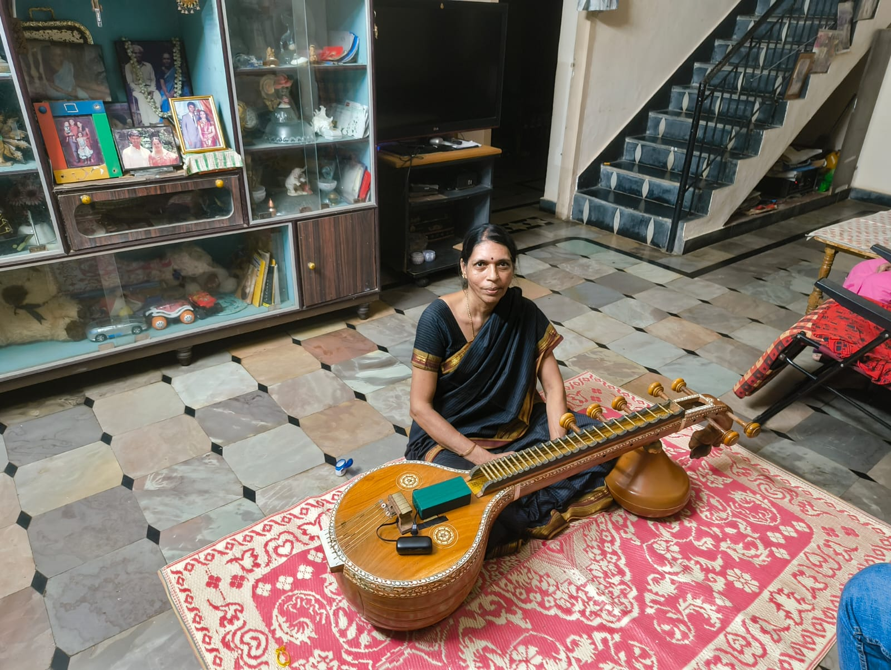
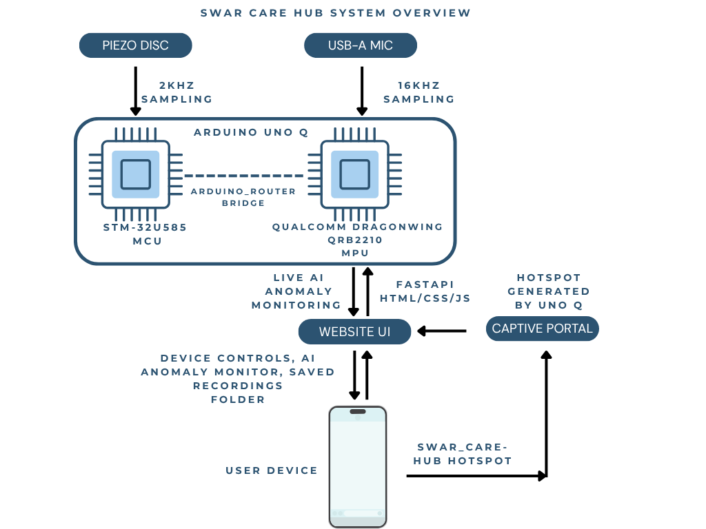
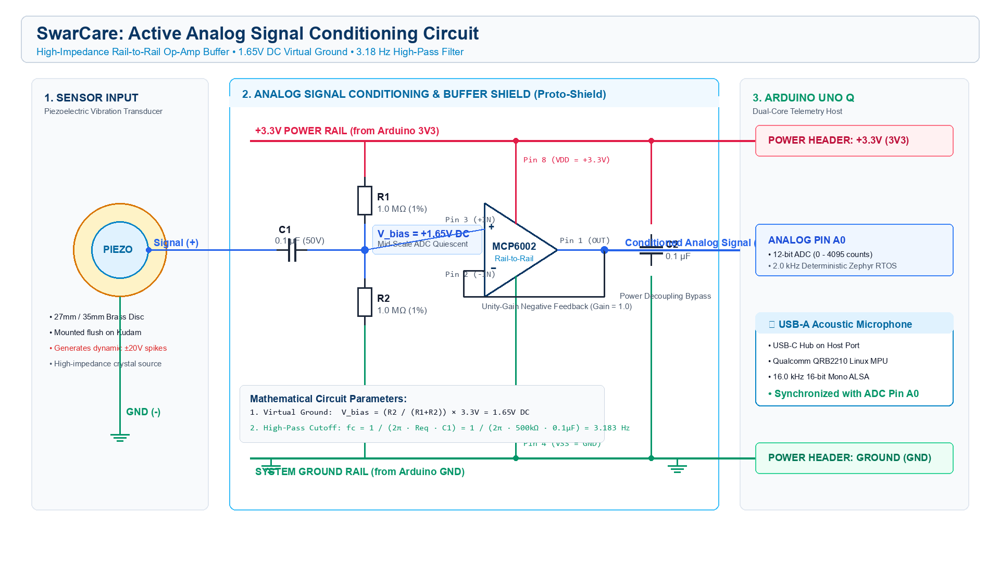
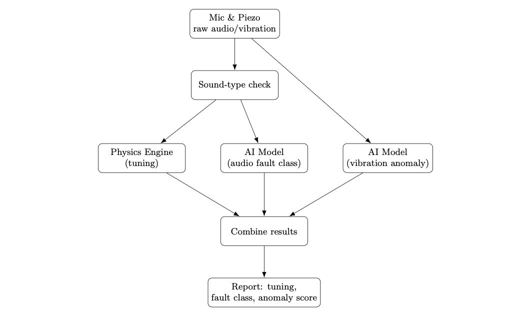
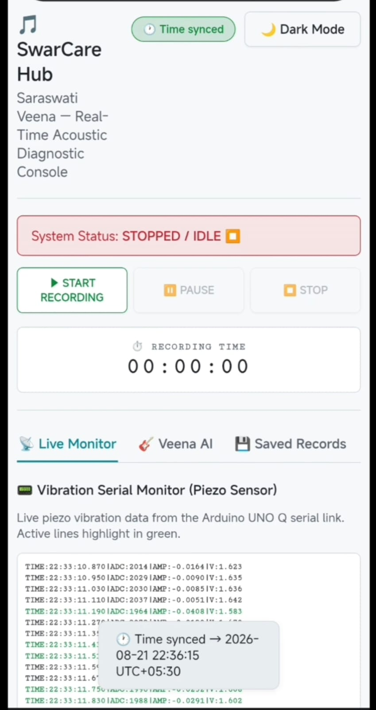
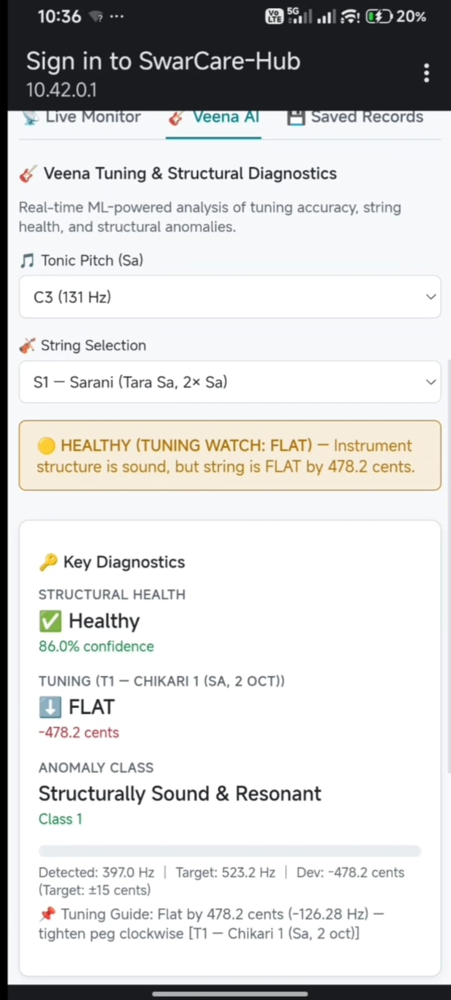

# 🎵 SwarCare - Saraswati Veena Anomaly Monitor

> **An Edge AI Vibroacoustic Diagnostic Hub on Arduino UNO Q for Real-Time Structural Health Monitoring, Acoustic Timbre Analysis, and Precision String Tuning of the Saraswati Veena**

---

[](https://store.arduino.cc/)
[](https://store.arduino.cc/)
[](https://zephyrproject.org/)
[](https://fastapi.tiangolo.com/)
[](https://www.tensorflow.org/lite)
[](https://github.com/blackviper004/Hackathon_Arduino_Q_Space_Data)
[](https://opensource.org/licenses/MIT)

---

## 💡 The Story: Why SwarCare?

The **Saraswati Veena** is the premier plucked chordophone of South Indian Carnatic classical music. Handcrafted from solid aged Jackwood (*Artocarpus heterophyllus*), it produces rich, non-linear harmonics through its curved brass bridge (*Kudurai*).

However, climate shifts and aging cause severe structural defects:
- **Resonator Fractures:** Microscopic cracks in the hollow Jackwood sound box (*Kudam*).
- **Fretbed Creep:** Softening of the traditional beeswax-charcoal compound holding 24 brass frets.
- **Bridge Tilt & Wear:** Asymmetrical brass bridge posture causing harsh buzzing (*jhalli*).
- **Peg Slippage:** Friction peg slippage in tropical humidity causing continuous detuning.

With traditional master luthiers (*Asaris*) becoming rare, musicians have lacked an objective diagnostic tool. **SwarCare** solves this by turning the **Arduino UNO Q** into a non-invasive, dual-sensor Edge AI diagnostic lab mounted directly onto the instrument.

<p align="center">
  
  <br><em>Figure 1: SwarCare dual-core sensing hub mounted directly on the Jackwood Kudam of the Saraswati Veena.</em>
</p>

---

## ⚡ Heterogeneous Dual-Core Architecture

SwarCare splits computing tasks across the two hardware cores of the **Arduino UNO Q**:

```
[ Piezo Disc (Vibration) ] ──► [ STM32U585 MCU (Zephyr RTOS) ] ──► 2.0 kHz Deterministic ADC (bufA / bufB)
                                              │
                                 MsgPack UART Bridge (115.2 kbps)
                                              ▼
[ USB-A Mic (Acoustic)   ] ──► [ Qualcomm QRB2210 Linux MPU ]  ──► 16.0 kHz Audio & Parallel Hybrid AI
                                              │
                                  Zero-Config Wi-Fi SoftAP
                                              ▼
                                 📱 Web UI HTML Bricks (Browser)
```

<p align="center">
  
  <br><em>Figure 2: End-to-end heterogeneous dual-core acquisition and processing pipeline.</em>
</p>

1. **Deterministic 2.0 kHz Sampling (STM32U585 MCU):** Runs **Zephyr RTOS** (Priority 1) with a hardware timer (`k_timer`) firing every $500\ \mu\text{s}$. Ping-pong double buffers (`bufA`/`bufB`) pack 40 samples into a 92-byte binary struct, serialized into MsgPack binary containers and transmitted over the internal UART bridge at only $4.60\text{ kB/s}$ (zero buffer overflow).
2. **Phase-Locked Recording & AI Inference (Qualcomm QRB2210 Linux MPU):** Streams $16.0\text{ kHz}$ mono audio via ALSA, consumes vibration packets from a FIFO queue, synchronizes durations via $T_{sync} = \min(p_{dur}, a_{dur})$, and executes the Parallel Hybrid AI Engine.
3. **Zero-RTC Epoch Time Synchronization:** Connecting client devices automatically send `Date.now()`, calibrating all timestamps to Indian Standard Time (IST) without needing an onboard hardware RTC or internet NTP.

---

## 🔌 Analog Signal Conditioning Circuit

Piezoelectric discs produce transient voltage spikes exceeding $\pm 20\text{ V}$, which would damage $3.3\text{ V}$ microcontroller inputs. SwarCare uses an active analog conditioning shield with a single input-side coupling capacitor:

<p align="center">
  
  <br><em>Figure 3: Active analog signal conditioning and overvoltage protection circuit schematic.</em>
</p>

### Circuit Key Specifications:
- **$1.65\text{ V}$ Virtual Ground Biasing:** Symmetrical $1.0\text{ M}\Omega$ divider ($R_1, R_2$) establishes $V_{bias} = V_{CC}/2 = 1.65\text{ V}$, centering the 12-bit ADC at mid-scale (code 2048) to capture both positive and negative vibration deflections without clipping.
- **Input-Side High-Pass Filter ($R_{eq} = 500\text{ k}\Omega, C_1 = 0.1\ \mu\text{F}$):**
  $$f_c = \frac{1}{2\pi \cdot R_{eq} \cdot C_1} = \frac{1}{2\pi \times (500 \times 10^3\ \Omega) \times (0.1 \times 10^{-6}\text{ F})} = 3.183\text{ Hz}$$
  Single ceramic capacitor $C_1$ is positioned solely at the input side, blocking DC drift while passing the lowest Veena fundamental frequencies ($S_4 \approx 58.9\text{ Hz}$) with zero attenuation.
- **MCP6002 Rail-to-Rail Buffer (Direct Output):** Ultra-high input impedance ($>10^{12}\ \Omega$) eliminates crystal charge loading. The op-amp output connects directly to Arduino pin `A0` without an output capacitor, preserving the $1.65\text{ V}$ DC offset for single-ended ADC acquisition.

---

## 🧰 Bill of Materials (BOM)

| Component | Quantity | Part / Model | Purpose |
|---|:---:|---|---|
| **Arduino UNO Q (4GB/32GB)** | 1 | `UNO-Q-4G-32G` | Heterogeneous dual-core host (STM32U585 MCU + Qualcomm QRB2210 Linux MPU). |
| **MCP6002 Rail-to-Rail Op-Amp** | 1 | `MCP6002-I/P` | Unity-gain buffer isolating high-impedance piezo crystals. |
| **1 MΩ Precision Resistors** | 2 | $1.0\text{ M}\Omega$ (1%, 0.25W) | Symmetrical voltage divider generating $1.65\text{ V}$ virtual ground. |
| **0.1 µF Ceramic Capacitor** | 1 | $0.1\ \mu\text{F}$ (50V) | $C_1$ AC coupling high-pass filter at input side (no output capacitor). |
| **Piezoelectric Disc (27/35mm)** | 1 | Brass Disc | Acoustic vibration contact pickup on Kudam body. |
| **USB-A Acoustic Microphone** | 1 | USB Audio Class | $16.0\text{ kHz}$ high-fidelity acoustic sound capture. |
| **Arduino UNO Proto-Shield** | 1 | Proto-Shield Rev3 | Compact hardware prototyping substrate. |
| **5V / 3A USB-C Power Bank** | 1 | 5,000 mAh | Portable battery-isolated power supply. |

---

## 🧠 Parallel Hybrid AI Diagnostic Engine

<p align="center">
  
  <br><em>Figure 4: Parallel Hybrid AI Engine architecture.</em>
</p>

> **Key Discovery:** Structural defects shift string resonance by $> \pm 15$ cents. A sequential pitch gate rejects $69.6\%$ of damaged instruments before classification. SwarCare runs both branches **simultaneously in parallel**:

### Branch A: Deterministic Physics Pitch Engine
- **Cepstral Lifter:** Strips natural Jackwood body resonance ($280-300\text{ Hz}$) to prevent false octave locks.
- **Harmonic Product Spectrum ($R=4$):** Collapses harmonic energy onto suppressed fundamental frequencies.
- **pYIN + 22 Carnatic Sruti Priors:** Resolves non-linear bridge grazing with a $\pm 15$ cent decision gate.

### Branch B: ML Structural Quality Classifier
- **527-D Hybrid Feature Vector:** 521-D Google YAMNet embeddings + 6 physical metrics ($F_0$, S1 error, Energy Decay Rate $d\text{RMS}/dt$, High-Frequency Flatness).
- **Random Forest Model:** Classifies health across 11 states (Healthy, Fret Wear, Kudam Crack, Loose Peg, String Buzz, Bridge Tilt, etc.).

---

## 📱 Modular Web UI HTML Bricks (`arduino:web_ui`)

Packaged natively for **Arduino App Lab** (`app.yaml`), the user interface consists of modular **Web UI HTML Bricks**:

<p align="center">
  
  
  <br><em>Figure 5: (Left) Live Oscilloscope & Serial Terminal Bricks. (Right) Veena AI Real-Time Tuning & Health Diagnostic Bricks.</em>
</p>

1. 📟 **Vibration Serial Terminal Brick (`terminal.js`):** Streams real-time 12-bit ADC data lines, voltages, and amplitudes at $2.0\text{ kHz}$.
2. 🎙️ **Audio Live Oscilloscope Brick (`scope.js`):** Hardware-accelerated HTML5 Canvas rendering real-time normalized acoustic waveforms at $24\text{ FPS}$.
3. 🎸 **Veena AI Tuning & Diagnostic Brick (`veena.js`):** Interactive cents deviation gauge (e.g. `"Flat by 14.2 Cents — Tighten Peg"`) with an 11-state structural anomaly classification card.
4. 💾 **Saved Records Explorer Brick (`records.js`):** In-browser WAV audio player, synchronized CSV inspector, and 1-click **`Download All as ZIP`** batch exporter.
5. 🎨 **Theme & State Manager Brick (`theme.js` & `app.js`):** Responsive dark/light theme engine and single-socket WebSocket router (`/ws/telemetry` at $8\text{ Hz}$).

---

## 🚀 Step-by-Step Tutorial: Build & Deploy

### Step 1: Assemble the Analog Shield
1. Solder the MCP6002 Op-Amp onto the center of the Arduino Proto-Shield.
2. Solder the two $1.0\text{ M}\Omega$ resistors between `3.3V` and `GND`, connecting their midpoint to MCP6002 Pin 3 (`+IN1`).
3. Connect the single $0.1\ \mu\text{F}$ coupling capacitor ($C_1$) at the input side between the Piezo $(+)$ input and MCP6002 Pin 3 (`+IN1`).
4. Wire a feedback jumper between MCP6002 Pin 1 (`OUT1`) and Pin 2 (`-IN1`) for unity gain.
5. Connect MCP6002 Pin 1 (`OUT1`) directly to Arduino analog header pin **`A0`** (no output capacitor).
6. Stack the completed Proto-Shield onto the Arduino UNO Q headers.

### Step 2: Deploy via Arduino App Lab
1. Connect the Arduino UNO Q to your computer via USB-C.
2. Launch **Arduino App Lab** and open the project directory ([`swar_care_final`](https://github.com/blackviper004/Hackathon_Arduino_Q_Space_Data/tree/main/swar_care_final)).
3. Click **Deploy & Run**. Arduino App Lab automatically:
   - Compiles and flashes `sketch/sketch.ino` to the STM32U585 MCU via Zephyr RTOS.
   - Launches the FastAPI backend and Web UI Bricks on the Qualcomm Linux MPU.

### Step 3: Mount Sensor Module on the Veena
1. Apply acoustic double-sided adhesive tape to the base of the sensor module.
2. Mount the module on the Jackwood **Kudam (resonator)** surface directly adjacent to the 4th string ($S_4$ Anumandra), approximately **$3\text{ to }5\text{ cm}$ away from the brass Kudurai bridge**.
3. Position the USB-A microphone directly under the string plane facing upward.

### Step 4: Connect & Diagnose
1. Connect your smartphone, tablet, or laptop to the Wi-Fi hotspot: **`Swar_Care-Hub`** *(Password: Open)*.
2. The **Captive Portal** automatically launches the diagnostic dashboard.
3. Click **`START RECORDING`** and pluck any string to monitor live tuning, acoustic waveforms, and structural health in real time!

---

## 🔗 Video Demonstration & Code Repository

- 📺 **YouTube Video Demonstration:** [Watch SwarCare in Action on YouTube](https://youtube.com/) *(Add your YouTube video link here)*
- 💻 **GitHub Source Repository:** [blackviper004 / Hackathon_Arduino_Q_Space_Data](https://github.com/blackviper004/Hackathon_Arduino_Q_Space_Data)
- 📁 **App Lab Project Directory:** [`swar_care_final`](https://github.com/blackviper004/Hackathon_Arduino_Q_Space_Data/tree/main/swar_care_final)

---

## 💻 Core Firmware Implementation (`sketch.ino`)

```cpp
#include <Arduino_RouterBridge.h>
#include <zephyr/kernel.h>

const int PIEZO_PIN      = A0;
const int SAMPLE_RATE_HZ = 2000;
const int BATCH_SIZE     = 40;

// Chrono-Anchored Packed Structure (92 bytes)
struct __attribute__((packed)) TelemetryPacket {
  uint32_t batch_start_idx;       // 4 bytes: Global sample index
  uint64_t batch_start_us;        // 8 bytes: Zephyr hardware microsecond timestamp
  uint16_t samples[BATCH_SIZE];   // 80 bytes: 40 raw 12-bit ADC samples
};

volatile uint16_t bufA[BATCH_SIZE], bufB[BATCH_SIZE];
volatile uint16_t* currentBuf = bufA;
volatile uint16_t* sendBuf = nullptr;
volatile int bufIndex = 0;
volatile bool batchReady = false;
volatile uint32_t sampleCount = 0, batchStart = 0, readyBatchStart = 0;
volatile uint64_t batchStartUs = 0, readyBatchStartUs = 0;

struct k_timer sample_timer;
struct k_thread sampler_thread;
K_THREAD_STACK_DEFINE(sampler_stack, 1024);

void sampler_thread_entry(void *p1, void *p2, void *p3) {
  k_timer_init(&sample_timer, NULL, NULL);
  k_timer_start(&sample_timer, K_USEC(500), K_USEC(500)); // 2.0 kHz
  
  while (1) {
    k_timer_status_sync(&sample_timer);
    if (bufIndex == 0) {
      batchStart = sampleCount;
      batchStartUs = k_ticks_to_us_near64(k_uptime_ticks());
    }
    currentBuf[bufIndex++] = (uint16_t)analogRead(PIEZO_PIN);
    sampleCount++;
    
    if (bufIndex >= BATCH_SIZE) {
      sendBuf = currentBuf;
      readyBatchStart = batchStart;
      readyBatchStartUs = batchStartUs;
      currentBuf = (currentBuf == bufA) ? bufB : bufA;
      bufIndex = 0;
      batchReady = true;
    }
  }
}

void setup() {
  Bridge.begin();
  analogReadResolution(12);
  pinMode(PIEZO_PIN, INPUT);
  k_thread_create(&sampler_thread, sampler_stack, K_THREAD_STACK_SIZEOF(sampler_stack),
                  sampler_thread_entry, NULL, NULL, NULL, 1, 0, K_NO_WAIT);
}

void loop() {
  if (batchReady) {
    noInterrupts();
    volatile uint16_t* buffer = sendBuf;
    uint32_t startIdx = readyBatchStart;
    uint64_t startUs = readyBatchStartUs;
    batchReady = false;
    interrupts();
    
    TelemetryPacket packet;
    packet.batch_start_idx = startIdx;
    packet.batch_start_us = startUs;
    for (int i = 0; i < BATCH_SIZE; i++) packet.samples[i] = buffer[i];

    MsgPack::bin_t<unsigned char> msgpack_blob;
    msgpack_blob.resize(sizeof(TelemetryPacket));
    memcpy(msgpack_blob.data(), &packet, sizeof(TelemetryPacket));
    Bridge.notify("piezo_batch", msgpack_blob);
  }
  k_yield();
}
```

---

## 📄 License

This project is licensed under the **MIT License** — see the [LICENSE](LICENSE) file for complete details.

```
Copyright (c) 2026 SwarCare Project Contributors

Permission is hereby granted, free of charge, to any person obtaining a copy
of this software and associated documentation files (the "Software"), to deal
in the Software without restriction, including without limitation the rights
to use, copy, modify, merge, publish, distribute, sublicense, and/or sell
copies of the Software, and to permit persons to whom the Software is
furnished to do so, subject to the following conditions:

The above copyright notice and this permission notice shall be included in all
copies or substantial portions of the Software.
```

---

<div align="center">
  <sub>Engineered with precision on the Arduino UNO Q for Indian Classical Music preservation.</sub>
</div>
